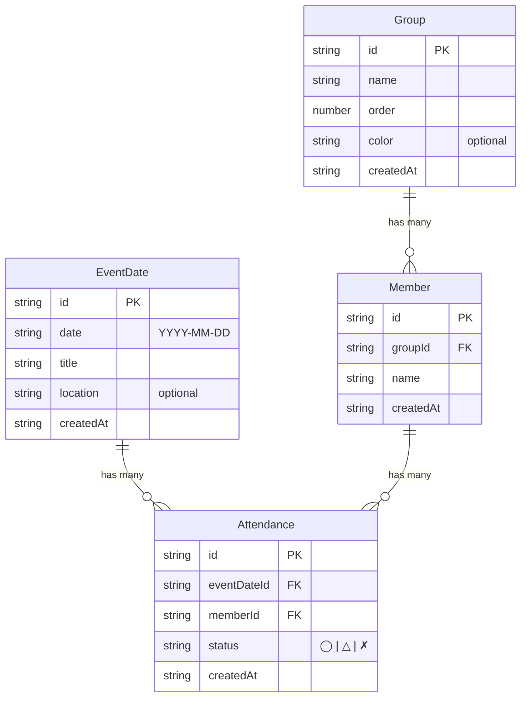

# Data Model: 複数イベント一括出欠登録

**Feature**: 004-bulk-attendance-register
**Date**: 2025-11-08
**Purpose**: エンティティ設計、型定義、データ整合性ルール

## Overview

本フィーチャーでは既存のエンティティ（EventDate, Group, Member, Attendance）をそのまま活用し、新規に一括登録用の型定義（BulkAttendanceInput, BulkAttendanceResult）を追加する。データベーススキーマの変更は不要。

---

## Entity Relationship Diagram



**重要な制約**:
- `Attendance`エンティティで`(eventDateId, memberId)`の組み合わせは**論理的に一意**である必要がある
- データベースレベルのUNIQUE制約はないが、アプリケーションレベル（upsert関数）で保証

---

## Existing Entities (既存エンティティ)

### EventDate（イベント日程）

```typescript
export interface EventDate {
  id: string;                // UUID
  date: string;              // YYYY-MM-DD形式（例: "2025-01-15"）
  title: string;             // イベント名（例: "練習", "本番"）
  location?: string;         // 場所（任意、例: "音楽室"）
  createdAt: string;         // ISO 8601形式（例: "2025-01-08T12:00:00.000Z"）
}
```

**説明**:
- 出欠登録の対象となるイベント
- 一括登録画面では複数のEventDateを選択可能

**Validation Rules**:
- `id`: UUID v4
- `date`: YYYY-MM-DD形式、未来の日付を推奨
- `title`: 1文字以上、100文字以下
- `location`: 任意、100文字以下

---

### Group（グループ）

```typescript
export interface Group {
  id: string;                // UUID
  name: string;              // グループ名（例: "トランペット", "営業部"）
  order: number;             // 表示順（昇順）
  color?: string;            // UI表示用の色（任意、例: "#FF0000"）
  createdAt: string;         // ISO 8601形式
}
```

**説明**:
- メンバーが所属するグループ（楽器パート、部署、クラスなど）
- 一括登録画面では最初に1つのGroupを選択

**Validation Rules**:
- `id`: UUID v4
- `name`: 1文字以上、50文字以下、同一名重複不可
- `order`: 0以上の整数
- `color`: 任意、Hex color code形式（#RRGGBB）

---

### Member（メンバー）

```typescript
export interface Member {
  id: string;                // UUID
  groupId: string;           // 所属グループID（FK）
  name: string;              // メンバー名（例: "田中太郎"）
  createdAt: string;         // ISO 8601形式
}
```

**説明**:
- グループに所属する個人
- 一括登録画面では選択したGroup内のMemberを1人選択（または新規作成）

**Validation Rules**:
- `id`: UUID v4
- `groupId`: 既存Groupの`id`である必要がある
- `name`: 1文字以上、50文字以下
- 同一グループ内で同一名前の重複は警告（ただしシステムエラーではない）

**Relationships**:
- 1つのGroupに対して多数のMemberが所属（1対多）
- 1つのMemberは複数のAttendanceを持つ（1対多）

---

### Attendance（出欠レコード）

```typescript
export interface Attendance {
  id: string;                // UUID
  eventDateId: string;       // イベント日程ID（FK）
  memberId: string;          // メンバーID（FK）
  status: AttendanceStatus;  // 出欠ステータス（'◯' | '△' | '✗'）
  createdAt: string;         // ISO 8601形式
}

export type AttendanceStatus = '◯' | '△' | '✗';
```

**説明**:
- 特定のメンバーが特定のイベントに対して登録した出欠状況
- 一括登録機能では、複数のAttendanceレコードを一度に作成または更新（upsert）

**Validation Rules**:
- `id`: UUID v4
- `eventDateId`: 既存EventDateの`id`である必要がある
- `memberId`: 既存Memberの`id`である必要がある
- `status`: '◯'（出席）、'△'（未定）、'✗'（欠席）のいずれか
- `createdAt`: ISO 8601形式、自動生成

**重要な制約**:
- **論理的な一意性**: `(eventDateId, memberId)`の組み合わせは一意である必要がある
  - 同じメンバーが同じイベントに複数の出欠レコードを持つことは不正
  - upsert関数でこの制約を保証（重複検出→更新 or 新規作成）

**Relationships**:
- 1つのEventDateに対して多数のAttendanceが紐づく（1対多）
- 1つのMemberに対して多数のAttendanceが紐づく（1対多）

---

## New Type Definitions (新規型定義)

### BulkAttendanceInput（一括登録の入力データ）

```typescript
export interface BulkAttendanceInput {
  eventDateId: string;       // イベント日程ID
  memberId: string;          // メンバーID
  status: AttendanceStatus;  // 出欠ステータス（'◯' | '△' | '✗'）
}
```

**Purpose**:
- 一括登録関数（`upsertBulkAttendances`）の入力パラメータ
- 既存の`AttendanceInput`型（`id`と`createdAt`を除いたもの）と同等

**Validation Rules**:
- 既存の`CreateAttendanceInputSchema`（Zod）を再利用
- `eventDateId`: UUID v4、既存EventDateの`id`
- `memberId`: UUID v4、既存Memberの`id`
- `status`: '◯' | '△' | '✗'

**Example**:
```typescript
const inputs: BulkAttendanceInput[] = [
  { eventDateId: 'event-1', memberId: 'member-1', status: '◯' },
  { eventDateId: 'event-2', memberId: 'member-1', status: '△' },
  { eventDateId: 'event-3', memberId: 'member-1', status: '✗' },
];
```

---

### BulkAttendanceResult（一括登録の結果）

```typescript
export interface BulkAttendanceResult {
  success: Attendance[];      // 新規作成に成功した出欠レコード
  updated: Attendance[];      // 既存レコードの更新に成功した出欠レコード
  failed: Array<{             // 失敗した項目とエラー情報
    input: BulkAttendanceInput;
    error: string;
  }>;
}
```

**Purpose**:
- `upsertBulkAttendances`関数の戻り値
- 成功、更新、失敗の内訳をユーザーにフィードバックするため

**Fields**:
- `success`: 新規作成されたAttendanceレコードの配列
  - 既存に同じ`(eventDateId, memberId)`のレコードがなかった場合
- `updated`: 更新されたAttendanceレコードの配列
  - 既存に同じ`(eventDateId, memberId)`のレコードがあり、ステータスを更新した場合
- `failed`: バリデーションエラーやその他の理由で失敗した項目
  - `input`: 失敗した入力データ
  - `error`: エラーメッセージ（日本語、ユーザーフレンドリー）

**Example**:
```typescript
const result: BulkAttendanceResult = {
  success: [
    { id: 'att-1', eventDateId: 'event-1', memberId: 'member-1', status: '◯', createdAt: '2025-01-08T12:00:00Z' },
  ],
  updated: [
    { id: 'att-2', eventDateId: 'event-2', memberId: 'member-1', status: '△', createdAt: '2025-01-07T10:00:00Z' },
  ],
  failed: [
    { input: { eventDateId: 'invalid', memberId: 'member-1', status: '◯' }, error: 'イベントIDが無効です' },
  ],
};

// ユーザーフィードバック:
// "2件登録（うち1件更新）、1件失敗しました"
```

---

## Data Integrity Rules (データ整合性ルール)

### 1. Attendance の一意性保証

**ルール**:
- 同一の`(eventDateId, memberId)`の組み合わせを持つAttendanceレコードは最大1件
- 複数件存在する場合は重複とみなし、最新の`createdAt`を持つレコードのみ保持

**Implementation**:
```typescript
// upsertAttendance関数内で重複チェック
const duplicates = attendances.filter(
  (a) => a.eventDateId === input.eventDateId && a.memberId === input.memberId
);

if (duplicates.length > 1) {
  // 最新のレコードを特定
  const latest = duplicates.sort((a, b) =>
    new Date(b.createdAt).getTime() - new Date(a.createdAt).getTime()
  )[0];

  // 古いレコードを削除
  attendances = attendances.filter(
    (a) => !(a.eventDateId === input.eventDateId && a.memberId === input.memberId && a.id !== latest.id)
  );
}
```

### 2. 外部キー参照整合性（アプリケーションレベル）

**ルール**:
- `Attendance.eventDateId`は既存の`EventDate.id`を参照する必要がある
- `Attendance.memberId`は既存の`Member.id`を参照する必要がある
- `Member.groupId`は既存の`Group.id`を参照する必要がある

**Implementation**:
- Zodスキーマでバリデーション
- サービス層でIDの存在確認（`loadEventDates()`、`loadMembers()`など）

```typescript
// バリデーション例（Zodスキーマ）
export const CreateAttendanceInputSchema = z.object({
  eventDateId: z.string().uuid(),
  memberId: z.string().uuid(),
  status: z.enum(['◯', '△', '✗']),
}).refine(
  (data) => {
    // イベントとメンバーの存在確認
    const events = loadEventDates();
    const members = loadMembers();
    return events.some((e) => e.id === data.eventDateId) &&
           members.some((m) => m.id === data.memberId);
  },
  { message: 'イベントまたはメンバーが存在しません' }
);
```

### 3. データの不変性（createdAt）

**ルール**:
- `createdAt`は初回作成時に自動生成され、その後は変更しない
- upsertで既存レコードを更新する場合、`createdAt`は元の値を保持

**Rationale**:
- 「いつ最初に登録されたか」の履歴情報を保持
- 監査ログとして有用（将来的に`updatedAt`フィールド追加を検討）

---

## Storage Schema (localStorage)

現在はlocalStorageに4つのキーで保存:

```typescript
const STORAGE_KEYS = {
  EVENT_DATES: 'attendance_event_dates',    // EventDate[]
  GROUPS: 'attendance_groups',              // Group[]
  MEMBERS: 'attendance_members',            // Member[]
  ATTENDANCES: 'attendance_attendances',    // Attendance[]
} as const;
```

**一括登録による変更**:
- `ATTENDANCES`キーのみ更新（upsert処理）
- 他のキー（EVENT_DATES, GROUPS, MEMBERS）は読み取り専用

---

## Future Migration (Supabase PostgreSQL)

将来的にlocalStorageからSupabase PostgreSQLへ移行する際の考慮事項:

### テーブル定義

```sql
CREATE TABLE event_dates (
  id UUID PRIMARY KEY DEFAULT gen_random_uuid(),
  date DATE NOT NULL,
  title VARCHAR(100) NOT NULL,
  location VARCHAR(100),
  created_at TIMESTAMPTZ NOT NULL DEFAULT NOW()
);

CREATE TABLE groups (
  id UUID PRIMARY KEY DEFAULT gen_random_uuid(),
  name VARCHAR(50) NOT NULL UNIQUE,
  order INT NOT NULL,
  color VARCHAR(7),  -- #RRGGBB
  created_at TIMESTAMPTZ NOT NULL DEFAULT NOW()
);

CREATE TABLE members (
  id UUID PRIMARY KEY DEFAULT gen_random_uuid(),
  group_id UUID NOT NULL REFERENCES groups(id) ON DELETE CASCADE,
  name VARCHAR(50) NOT NULL,
  created_at TIMESTAMPTZ NOT NULL DEFAULT NOW()
);

CREATE TABLE attendances (
  id UUID PRIMARY KEY DEFAULT gen_random_uuid(),
  event_date_id UUID NOT NULL REFERENCES event_dates(id) ON DELETE CASCADE,
  member_id UUID NOT NULL REFERENCES members(id) ON DELETE CASCADE,
  status VARCHAR(1) NOT NULL CHECK (status IN ('◯', '△', '✗')),
  created_at TIMESTAMPTZ NOT NULL DEFAULT NOW(),
  UNIQUE (event_date_id, member_id)  -- 論理的な一意性を制約で保証
);

CREATE INDEX idx_attendances_event ON attendances(event_date_id);
CREATE INDEX idx_attendances_member ON attendances(member_id);
```

**重要な変更点**:
- `UNIQUE (event_date_id, member_id)`: データベースレベルで重複を防止
- `REFERENCES ... ON DELETE CASCADE`: 外部キー制約で参照整合性を保証
- インデックス: 検索パフォーマンス向上

---

## Summary

| エンティティ | 既存/新規 | 変更内容 |
|-------------|----------|---------|
| EventDate | 既存 | 変更なし |
| Group | 既存 | 変更なし |
| Member | 既存 | 変更なし |
| Attendance | 既存 | 変更なし（論理的な一意性を保証） |
| BulkAttendanceInput | 新規 | `types/index.ts`に追加 |
| BulkAttendanceResult | 新規 | `types/index.ts`に追加 |

**Next Phase**: API契約定義（contracts/attendance-service-api.md）、開発手順書（quickstart.md）の作成
