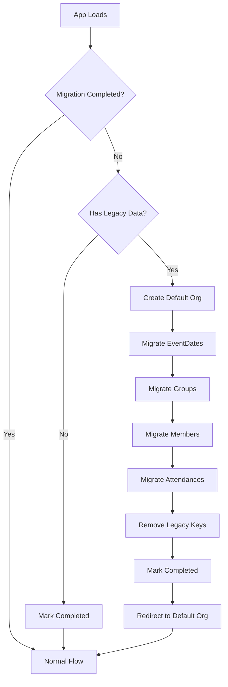

# サービス契約: Data Migration

**モジュール**: `lib/migration.ts`
**目的**: シングルテナント（v1.0）からマルチテナント（v2.0）データ構造への自動マイグレーション
**依存関係**: `lib/storage.ts`, `lib/organization-service.ts`, `nanoid`

## 概要

このモジュールは、レガシーlocalStorageデータ（v1.0）を検出し、以下の手順で新しいマルチテナント構造（v2.0）へ自動的にマイグレーションします:
1. デフォルト団体を作成
2. 既存のすべてのデータに`organizationId`を追加
3. データを新しい団体スコープのキーに移動
4. レガシーキーをクリーンアップ

**実行**: アップグレード後の初回ロード時に一度だけ実行、トップページ（`app/page.tsx`）からトリガー

## 関数

### `migrateToMultiTenant`

レガシーデータを検出してマルチテナント構造へマイグレーションします。

**シグネチャ**:
```typescript
function migrateToMultiTenant(): MigrationResult

interface MigrationResult {
  migrated: boolean;
  defaultOrgId?: string;
  error?: string;
}
```

**パラメータ**: なし

**戻り値**: `MigrationResult`
- `migrated: true` - マイグレーションが実行された
- `migrated: false` - マイグレーション不要（すでに実行済みまたはレガシーデータなし）
- `defaultOrgId?: string` - 作成されたデフォルト団体のID（マイグレーション実行時）
- `error?: string` - マイグレーション失敗時のエラーメッセージ

**動作**:

1. **マイグレーションフラグをチェック**:
   ```typescript
   const completed = localStorage.getItem('attendance_migration_completed');
   if (completed === 'true') return { migrated: false };
   ```

2. **レガシーデータを検出**:
   ```typescript
   const legacyKeys = [
     'attendance_event_dates',
     'attendance_groups',
     'attendance_members',
     'attendance_attendances'
   ];
   const hasLegacy = legacyKeys.some(key => localStorage.getItem(key) !== null);
   ```

3. **レガシーデータがない場合**、完了としてマークして終了:
   ```typescript
   if (!hasLegacy) {
     localStorage.setItem('attendance_migration_completed', 'true');
     return { migrated: false };
   }
   ```

4. **デフォルト団体を作成**:
   ```typescript
   const defaultOrgId = generateOrganizationId(); // nanoid
   const defaultOrg: Organization = {
     id: defaultOrgId,
     name: 'マイ団体',
     description: '既存データから自動作成された団体です',
     createdAt: new Date().toISOString(),
   };
   saveOrganizations([defaultOrg]);
   ```

5. **各データ型をマイグレーション**:
   ```typescript
   // EventDates
   const legacyEvents = JSON.parse(localStorage.getItem('attendance_event_dates') || '[]');
   const migratedEvents = legacyEvents.map(event => ({
     ...event,
     organizationId: defaultOrgId,
   }));
   saveEventDates(defaultOrgId, migratedEvents);
   localStorage.removeItem('attendance_event_dates');

   // Groups, Members, Attendances（同じパターン）
   ```

6. **マイグレーション完了をマーク**:
   ```typescript
   localStorage.setItem('attendance_migration_completed', 'true');
   return { migrated: true, defaultOrgId };
   ```

**エラー**:
- すべてのエラーをキャッチして`{ migrated: false, error: error.message }`を返す
- **ロールバック**: マイグレーションが失敗した場合、レガシーキーは削除されず、リトライが可能

**副作用**:
- 新しい団体を作成
- 新しいlocalStorageキーを作成
- レガシーlocalStorageキーを削除（成功時）
- マイグレーション完了フラグを設定

**例**:
```typescript
const result = migrateToMultiTenant();

if (result.migrated && result.defaultOrgId) {
  console.log(`Migrated to default org: ${result.defaultOrgId}`);
  router.push(`/${result.defaultOrgId}/`); // Redirect
} else if (result.error) {
  console.error('Migration failed:', result.error);
  alert('データ移行に失敗しました。');
}
```

---

### `hasLegacyData`

レガシー（v1.0）データがlocalStorageに存在するかチェックします。

**シグネチャ**:
```typescript
function hasLegacyData(): boolean
```

**パラメータ**: なし

**戻り値**: `boolean` - レガシーキーがデータを持つ場合に`true`

**動作**:
1. 各レガシーキーの存在をチェック
2. いずれかのキーがデータを持つ場合に`true`を返す

**例**:
```typescript
if (hasLegacyData()) {
  console.log('レガシーデータが検出されました。マイグレーションを推奨します');
}
```

---

### `isMigrationCompleted`

マイグレーションがすでに完了しているかチェックします。

**シグネチャ**:
```typescript
function isMigrationCompleted(): boolean
```

**パラメータ**: なし

**戻り値**: `boolean` - マイグレーションフラグが設定されている場合に`true`

**動作**:
1. localStorageから`attendance_migration_completed`フラグを読み込み
2. 値が`'true'`の場合に`true`を返す

**例**:
```typescript
if (isMigrationCompleted()) {
  console.log('マイグレーションはすでに完了しています');
}
```

---

## マイグレーションフロー



## データ変換

### 例: EventDateのマイグレーション

**変換前（v1.0）**:
```json
// localStorage.getItem('attendance_event_dates')
[
  {
    "id": "550e8400-e29b-41d4-a716-446655440000",
    "date": "2025-12-01",
    "title": "定期演奏会",
    "createdAt": "2025-11-01T10:00:00.000Z"
  }
]
```

**変換後（v2.0）**:
```json
// localStorage.getItem('attendance_abc123def_event_dates')
[
  {
    "id": "550e8400-e29b-41d4-a716-446655440000",
    "organizationId": "abc123def",  // 追加
    "date": "2025-12-01",
    "title": "定期演奏会",
    "createdAt": "2025-11-01T10:00:00.000Z"
  }
]
```

**レガシーキーを削除**: `attendance_event_dates` → `null`

---

## アプリとの統合

### トップページ (`app/page.tsx`)

```typescript
'use client';

import { useEffect } from 'react';
import { useRouter } from 'next/navigation';
import { migrateToMultiTenant } from '@/lib/migration';

export default function HomePage() {
  const router = useRouter();

  useEffect(() => {
    const result = migrateToMultiTenant();

    if (result.migrated && result.defaultOrgId) {
      // Redirect to default organization
      router.push(`/${result.defaultOrgId}/`);
    } else if (result.error) {
      // Show error message
      console.error('Migration failed:', result.error);
      // Fallback: allow user to create new organization manually
    }
    // If not migrated and no error, show normal landing page
  }, [router]);

  return (
    <div>
      <h1>Attendance Hub</h1>
      <p>新しい団体を作成するか、既存の団体URLにアクセスしてください。</p>
      {/* Organization creation form */}
    </div>
  );
}
```

---

## テスト要件

### ユニットテスト (`__tests__/lib/migration.test.ts`)

**必須テストケース**:

1. ✅ **レガシーデータなし**: `{ migrated: false }`を返し、完了としてマーク
2. ✅ **レガシーデータ存在**: デフォルト団体を作成
3. ✅ **EventDatesマイグレーション**: `organizationId`を追加、新しいキーに保存、レガシーキーを削除
4. ✅ **Groupsマイグレーション**: EventDatesと同様
5. ✅ **Membersマイグレーション**: EventDatesと同様
6. ✅ **Attendancesマイグレーション**: EventDatesと同様
7. ✅ **マイグレーションフラグ**: `attendance_migration_completed`を`'true'`に設定
8. ✅ **すでにマイグレーション済み**: 再実行せずに`{ migrated: false }`を返す
9. ✅ **エラーハンドリング**: マイグレーション失敗時にエラーを返し、レガシーキーを削除しない
10. ✅ **hasLegacyData**: レガシーキーを正しく検出
11. ✅ **isMigrationCompleted**: フラグを正しくチェック
12. ✅ **データ保存**: すべてのレガシーデータがマイグレーション形式で保持される
13. ✅ **ID生成**: デフォルト団体が一意な10文字のIDを取得

**カバレッジ目標**: 100%（重要なマイグレーションロジック）

### 統合テスト

**シナリオ**: 完全なマイグレーションワークフロー
```typescript
it('should migrate all data types correctly', () => {
  // Setup legacy data
  localStorage.setItem('attendance_event_dates', JSON.stringify([
    { id: '1', date: '2025-01-01', title: 'Event 1', createdAt: '...' }
  ]));
  localStorage.setItem('attendance_groups', JSON.stringify([
    { id: '2', name: 'Group 1', order: 1, createdAt: '...' }
  ]));
  localStorage.setItem('attendance_members', JSON.stringify([
    { id: '3', groupId: '2', name: 'Member 1', createdAt: '...' }
  ]));
  localStorage.setItem('attendance_attendances', JSON.stringify([
    { id: '4', eventDateId: '1', memberId: '3', status: '◯', createdAt: '...' }
  ]));

  // Run migration
  const result = migrateToMultiTenant();

  // Verify result
  expect(result.migrated).toBe(true);
  expect(result.defaultOrgId).toBeDefined();

  const orgId = result.defaultOrgId!;

  // Verify organizations created
  const orgs = loadOrganizations();
  expect(orgs).toHaveLength(1);
  expect(orgs[0].id).toBe(orgId);
  expect(orgs[0].name).toBe('マイ団体');

  // Verify event dates migrated
  const events = loadEventDates(orgId);
  expect(events).toHaveLength(1);
  expect(events[0].organizationId).toBe(orgId);

  // Verify groups migrated
  const groups = loadGroups(orgId);
  expect(groups).toHaveLength(1);
  expect(groups[0].organizationId).toBe(orgId);

  // Verify members migrated
  const members = loadMembers(orgId);
  expect(members).toHaveLength(1);
  expect(members[0].organizationId).toBe(orgId);

  // Verify attendances migrated
  const attendances = loadAttendances(orgId);
  expect(attendances).toHaveLength(1);
  expect(attendances[0].organizationId).toBe(orgId);

  // Verify legacy keys removed
  expect(localStorage.getItem('attendance_event_dates')).toBeNull();
  expect(localStorage.getItem('attendance_groups')).toBeNull();
  expect(localStorage.getItem('attendance_members')).toBeNull();
  expect(localStorage.getItem('attendance_attendances')).toBeNull();

  // Verify migration flag set
  expect(localStorage.getItem('attendance_migration_completed')).toBe('true');
});
```

---

## エラーハンドリング

### マイグレーション失敗

```typescript
const result = migrateToMultiTenant();

if (result.error) {
  // エラーをログ
  console.error('Migration failed:', result.error);

  // ユーザーフレンドリーなメッセージを表示
  alert('データ移行に失敗しました。ブラウザのキャッシュをクリアして再度お試しください。');

  // フォールバック: 新しい団体の作成を許可
  // リトライのためにレガシーデータはそのまま保持
}
```

### ロールバック戦略

- マイグレーションはアトミック: すべてのデータがマイグレーションされるか、まったくされないか
- いずれかのステップが失敗した場合、レガシーキーは削除されません
- ページをリフレッシュしてリトライ可能
- 手動フォールバック: localStorageをクリアして新規開始

---

## マイグレーションチェックリスト

v2.0デプロイ前:
- [ ] `lib/migration.ts`にマイグレーションロジックを実装
- [ ] ユニットテストがすべてのマイグレーションシナリオをカバー（100%カバレッジ）
- [ ] 統合テストが完全なワークフローを検証
- [ ] エラーハンドリングをテスト（localStorageエラーをシミュレート）
- [ ] トップページ統合完了
- [ ] ユーザーへの通知: マイグレーション失敗時のアラート/通知
- [ ] ロールバックをテスト: 失敗時にレガシーデータが保持されることを確認

---

**契約バージョン**: 1.0
**対象**: v1.0 → v2.0マイグレーション
**最終更新**: 2025-11-09
